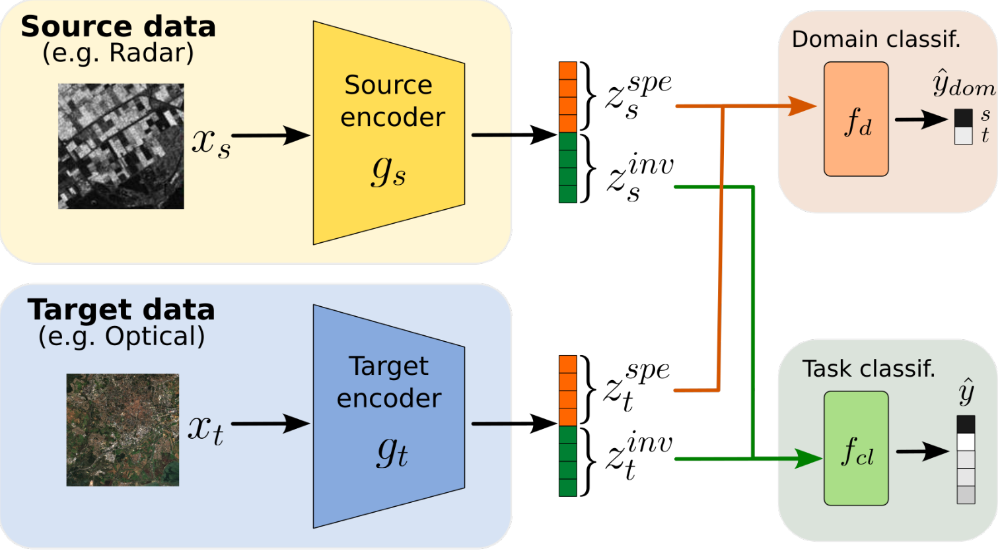

# SHeDD: Semi-Supervised Heterogeneous Domain Adaptation via Disentanglement

Code associated to the following ECML/PKDD 2024 publication:

> C. F. Dantas, R. Gaetano, D. Ienco. Semi Supervised Heterogeneous Domain Adaptation via Disentanglement and Pseudo-Labelling. ECML PKDD 2024. [ArXiv link.](https://arxiv.org/abs/2406.14087)

## Method description 
Semi-supervised domain adaptation methods leverage information from a source labelled domain with the goal of generalizing over a scarcely labelled target domain. While this setting already poses challenges due to potential distribution shifts between domains, an even more complex scenario arises when source and target data differs in modality representation (e.g. they are acquired by sensors with different characteristics). For instance, in remote sensing, images may be collected via various acquisition modes (e.g. optical or radar), different spectral characteristics (e.g. RGB or multi-spectral) and spatial resolutions. Such a setting is denoted as Semi-Supervised Heterogeneous Domain Adaptation (SSHDA) and it exhibits an even more severe distribution shift due to modality heterogeneity across domains. 
To cope with the challenging SSHDA setting, here we introduce SHeDD (Semi-supervised Heterogeneous Domain Adaptation via Disentanglement) an end-to-end neural framework tailored to learning a target domain classifier by leveraging both labelled and unlabelled data from heterogeneous data sources. SHeDD is designed to effectively disentangle domain-invariant representations, relevant for the downstream task, from domain-specific information, that can hinder the cross-modality transfer. Additionally, SHeDD adopts an augmentation-based consistency regularization mechanism that takes advantages of reliable pseudo-labels on the unlabelled target samples to further boost its generalization ability on the target domain. Empirical evaluations on two remote sensing benchmarks, encompassing heterogeneous data in terms of acquisition modes and spectral/spatial resolutions, demonstrate the quality of SHeDD compared to both baseline and state-of-the-art competing approaches.

## Code organization

Train and test of the proposed approach are performed in file `main.py`. Scripts corresponding to our competitors can be found at the `./competitors/` folder.
Our proposed model is defined in `model_pytorch.py` and some auxiliary functions are defined in `functions.py`.

### Data
To generate the data files compliant to our main scripts, the original datasets have to be downloaded and then processed by the pre-processing scripts provided in the `./preproc/` folder.
Run `preproc.py` followed by `preproc2.py`.

For instance, to reproduce the **EuroSAT-MS-SAR** benchmark, you can download the [EuroSAT MS](https://madm.dfki.de/files/sentinel/EuroSATallBands.zip) and [EuroSAT SAR](https://huggingface.co/datasets/wangyi111/EuroSAT-SAR/resolve/main/EuroSAT-SAR.zip) datasets, unzip them and place them at the same folder as the provided preprocessing before running them. This will generate all files necessary to obtain several train-test splits of the data.

### Input arguments 
Scripts take the following input arguments in order (they are used for data loading configuration and may be modified to meet your own dataset conventions):
1) Dataset path.
2) Source data prefix: identifies which data will serve as source domain modality. E.g.: *RESISC45* or *EURO* (for the *RESISC45-Euro* benchmark) and *MS* or *SAR* (for the *EuroSAT-MS-SAR* benchmark)
3) Target data prefix: same as above but for target domain.
4) Number of labelled samples on the target domain. E.g.: 25, 50, 100, 200.
5) Split number: choose a different train-test split. E.g.: 0, 1, 2, 3, 4.

